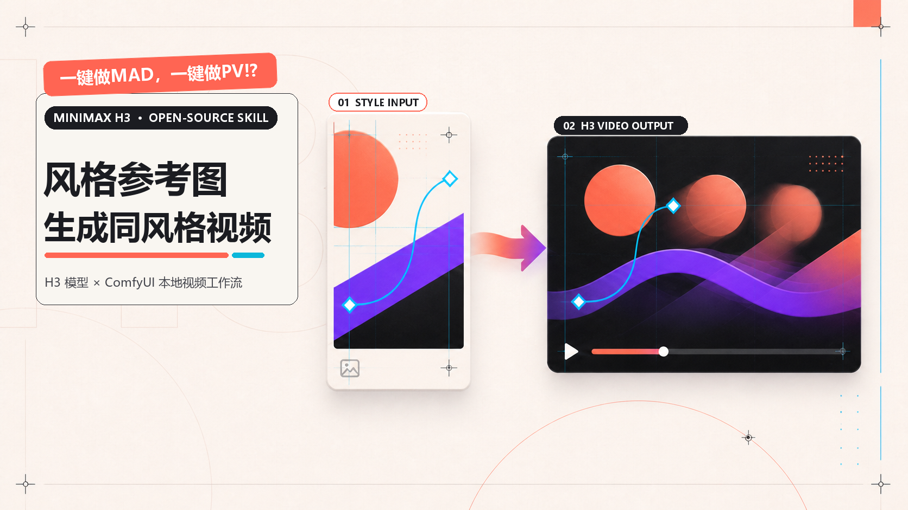

# MiniMax H3 风格参考视频 Skill



把用户上传的平面风格图或参考视频，转化为与其调性匹配的 15 秒 MiniMax H3 角色 PV、MAD、预告片或片头：不仅匹配配色，还会推导画面密度、版式、动效、文字动画、镜头节奏、转场、BGM 与音效关系。

本仓库公开两套可对照测试、可随时回退的 Codex Skill：

| 版本 | 目录 | 适用方向 |
|---|---|---|
| 当前版（推荐） | `skills/minimax-h3-local-video-generator` | 完整 BGM 参考输入、音乐主导节奏、跨模态风格统一、镜头与平面/动态多样性审计 |
| Pre-BGM 基线版 | `skills/minimax-h3-local-video-generator-pre-bgm` | 加入 BGM 参考输入前的历史基线，便于复现、A/B 测试与回退 |

## 核心能力

- 分析风格图或参考视频的美术 DNA、动效语法与节奏轮廓；
- 让视频的平面复杂度随参考复杂度双向匹配，避免复杂参考被做“简陋”；
- 自动询问并处理可选角色图、指定文案与用户 BGM；
- 角色图决定主体身份锚点和配色，动效体系仍由风格参考决定；
- 用户 BGM 接入 H3 音频参考节点，并可选择是否同时作为整体美术指导；
- 用非均匀镜头节奏、加速段和动势衔接避免平均切镜与明显停顿；
- 让文字造型、排版与多阶段文字动效服从同一套参考调性；
- 以迪士尼动画十二法则组织预备、主动作、跟随、缓冲、次级动作与夸张；
- 对同片重复构图、重复版式、重复运动和低信息增量镜头执行反重复审计；
- 先输出 H3 提示词供用户确认，再通过本地 ComfyUI 生成与复核。

## 安装

克隆仓库后，把需要测试的版本复制到 Codex 的 Skills 目录：

```powershell
git clone https://github.com/madersasuke/minimax-h3-video-skill.git
Copy-Item -Recurse -Force .\minimax-h3-video-skill\skills\minimax-h3-local-video-generator "$env:USERPROFILE\.codex\skills\"
Copy-Item -Recurse -Force .\minimax-h3-video-skill\skills\minimax-h3-local-video-generator-pre-bgm "$env:USERPROFILE\.codex\skills\"
```

重启或刷新 Codex 后，可用自然语言提出 MiniMax H3 本地 PV 制作需求，也可直接点名 `$minimax-h3-local-video-generator` 或 `$minimax-h3-local-video-generator-pre-bgm`。

## 本地生成配置

仓库不包含 MiniMax H3 模型权重、第三方 ComfyUI 节点或个人工作流文件。请先在本地准备兼容的 MiniMax H3 ComfyUI 工作流。脚本支持以下参数或环境变量：

| 用途 | CLI 参数 | 环境变量 |
|---|---|---|
| ComfyUI 地址 | `--server` | — |
| T2VA 模板 PNG | `--template-png` | `MINIMAX_H3_T2VA_TEMPLATE` |
| Ref2VA 模板 PNG | `--template-png` | `MINIMAX_H3_REF2VA_TEMPLATE` |
| ComfyUI 输入目录 | `--input-dir` | `COMFYUI_INPUT_DIR` |

模板 PNG 需要包含可用的 ComfyUI `prompt` 元数据。T2VA 队列脚本会显式选择 `minimax_h3_fl2va_pruned_int8_convrot.safetensors`；当前版的 BGM 参考路线会使用 `minimax_h3_ref2va_int8_convrot.safetensors`，并将音频接入 `ref_audios.ref_audio_0`。

示例：

```powershell
python .\scripts\queue_t2va.py `
  --prompt-file .\prompt.txt `
  --output-prefix demo_v01 `
  --template-png "D:\ComfyUI\output\known-good-template.png" `
  --dry-run
```

先使用 `--dry-run` 检查路由、模型、时长、画幅、MP、步数、种子和输出前缀，再提交正式任务。

## 依赖说明

Skill 会按任务需要调用 Codex 环境中的 `h3-prompt-writing`，并可能使用 `imagegen`、`hyperframes` 或 `video-use` 完成封面、确定性文字修正或成片整理。这些配套 Skill 与相关模型需由使用者自行安装或启用。

## 开源与免责声明

本仓库代码与 Skill 指令以 [MIT License](LICENSE) 开源。MiniMax、Hailuo、ComfyUI 及相关模型或项目名称归其各自权利人所有；本项目是独立的社区工作流，不代表官方合作或背书。请遵守模型、节点、字体、音乐、角色素材及平台各自的许可证和使用规范。
